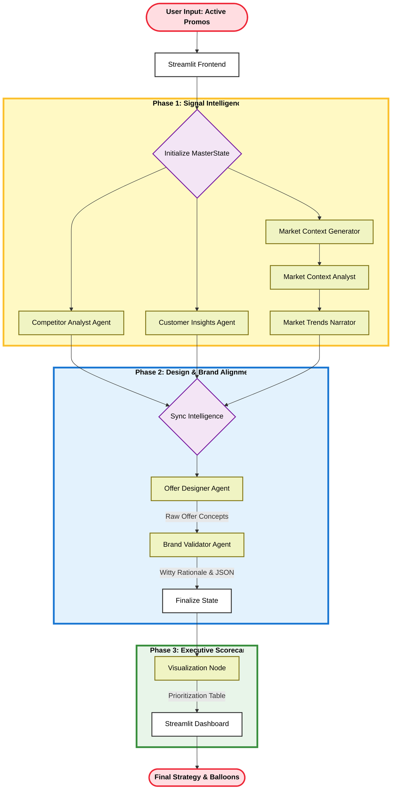

🍔 Wendy’s Signal-to-Offer Engine
Wendy’s Signal-to-Offer Engine is an AI-native strategic orchestrator that converts fragmented market noise into prioritized, evidence-backed marketing offers. Built using LangGraph and Streamlit, it simulates a digital "Boardroom" of specialized AI agents that analyze competitor threats, customer behavioral patterns, and high-velocity market trends in real-time.

🎯 The Problem
In the fast-paced QSR industry, marketing teams often struggle with "analysis paralysis." Decisions are frequently made based on stale data or gut feelings rather than a synthesized view of the entire market landscape. Our engine solves the "Trap Mechanism" of slow data processing, moving from signal to strategy in seconds.

🚀 The Solution: The SOAC Framework
Our engine uses a Parallel Fan-Out architecture to ensure every creative offer is grounded in multi-dimensional evidence:

S: Signal Quality & Depth – Every offer is backed by clear, traceable evidence (Signal IDs) and a recency-biased threat score.

O: Offer Creativity – Generates original, differentiated concepts like the "Baconator Streak" instead of generic discounts.

A: Agent Collaboration – Specialized agents (Sentinel, Psychologist, Scout) hand off state cleanly to build a cohesive strategy.

C: Clarity & Storytelling – A transparent executive scorecard that maps impact vs. feasibility for immediate action.

🏗 Project Architecture
The system is orchestrated as a stateful graph where intelligence is gathered in parallel before being synthesized by a creative lead.

